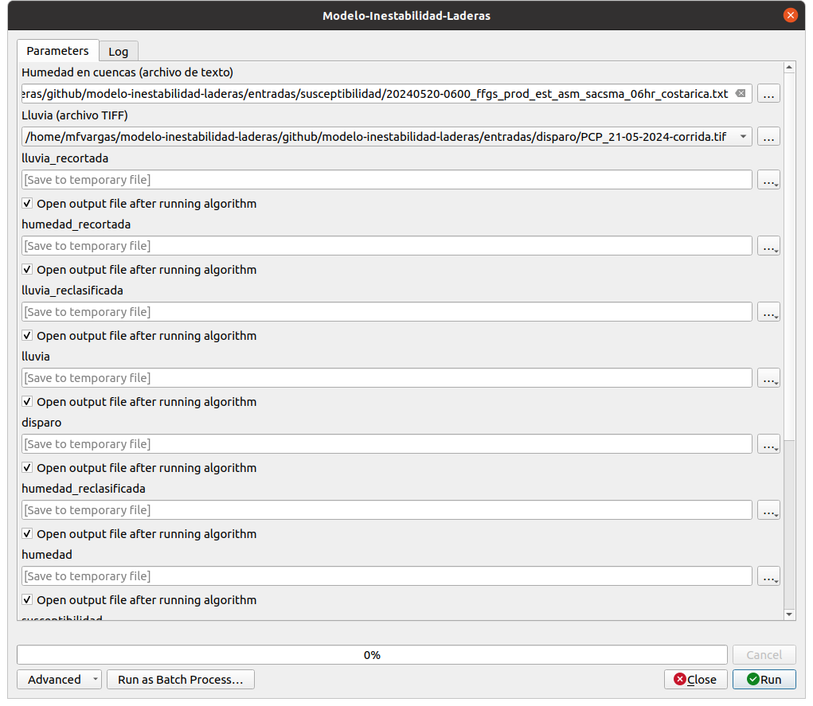
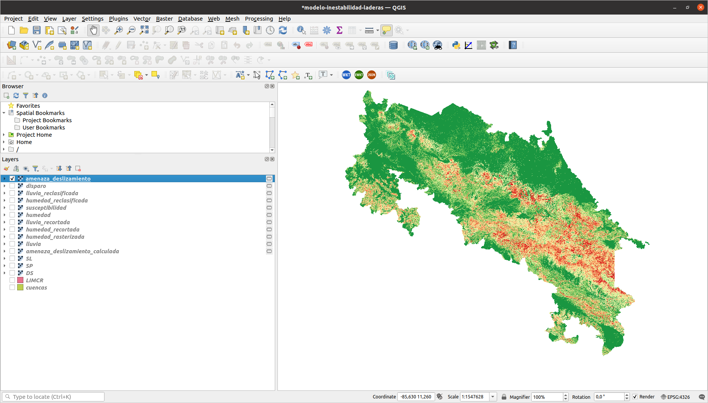

# Modelo de inestabilidad de laderas

Este repositorio contiene los archivos correspondientes a la implementación de un modelo de inestabilidad de laderas en el sistema de información geográfica [QGIS](https://qgis.org/).

[Video demostrativo sobre la instalación y el uso del modelo](https://raw.githubusercontent.com/modelo-inestabilidad-laderas/modelo-inestabilidad-laderas/main/doc/video/demostracion-instalacion-uso.mp4)

## Instalación
1. Instale en su computadora el sistema de información geográfica [QGIS](https://qgis.org/).

2. Descargue y descomprima en su computadora el archivo ZIP disponible en [https://github.com/modelo-inestabilidad-laderas/modelo-inestabilidad-laderas/archive/refs/heads/main.zip](https://github.com/modelo-inestabilidad-laderas/modelo-inestabilidad-laderas/archive/refs/heads/main.zip). El directorio descomprimido contiene:

    a. Un archivo llamado `modelo-inestabilidad-laderas.model3`, el cual contiene la implementación del modelo en el marco de trabajo de procesamiento de QGIS.

    b. Un archivo llamado `script/union-cuencas-humedad.py`, el cual contiene un *script* del marco de trabajo de procesamiento de QGIS, que forma parte del modelo.

    c. Un archivo llamado `modelo-inestabilidad-laderas.qgz`, el cual contiene un proyecto de QGIS con los archivos de datos necesarios para ejecutar el modelo.

3. Con la opción de menú **Project - Open** de QGIS, abra el proyecto en el archivo `modelo-inestabilidad-laderas.qgz`.

4. Con la opción de menú **Processing - Toolbox** de QGIS, abra la caja de herramientas del marco de trabajo de procesamiento. Luego, con **Scripts - Add Script to Toolbox...** agregue a la caja de herramientas (*toolbox*) el *script* en el archivo `script/union-cuencas-humedad.py`. Una vez hecho esto último, debe visualizar el *script* en la sección **Scripts** de la caja de herramientas, con el título **Modelo de inestabilidad de laderas - Unión de geometrías de cuencas y datos de humedad en cuencas**.

## Ejecución
1. Con la opción de menú **Processing - Graphical Modeler... - Model - Open Model...** de QGIS, abra el modelo en el archivo `modelo-inestabilidad-laderas.model3`.
2. Ejecute el modelo con la opción de menú **Model - Run Model...** de QGIS (o utilice el ícono correspondiente). 

    a. Especifique los archivos de entrada del sistema:

    - Humedad en cuencas (archivo de texto)  
    - Lluvia (archivo TIFF)      

    b. Especifique los archivos de salida del sistema. Si no se especifica un archivo, QGIS guardará los resultados como capas temporales que se borran al salir del programa. Se recomienda almacenar en un archivo, al menos el resultado final:

    - amenaza_deslizamiento  

    c. Inicie la ejecución con el botón **Run**.        

  
    
3. Al finalizar la ejecución, podrá visualizar en QGIS todas las salidas del modelo, incluyendo la capa `amenaza-deslizamiento`, la cual puede considerarse el resultado final. Puede estilizar esta capa con el archivo de estilos `amenaza-deslizamiento.qml`.

